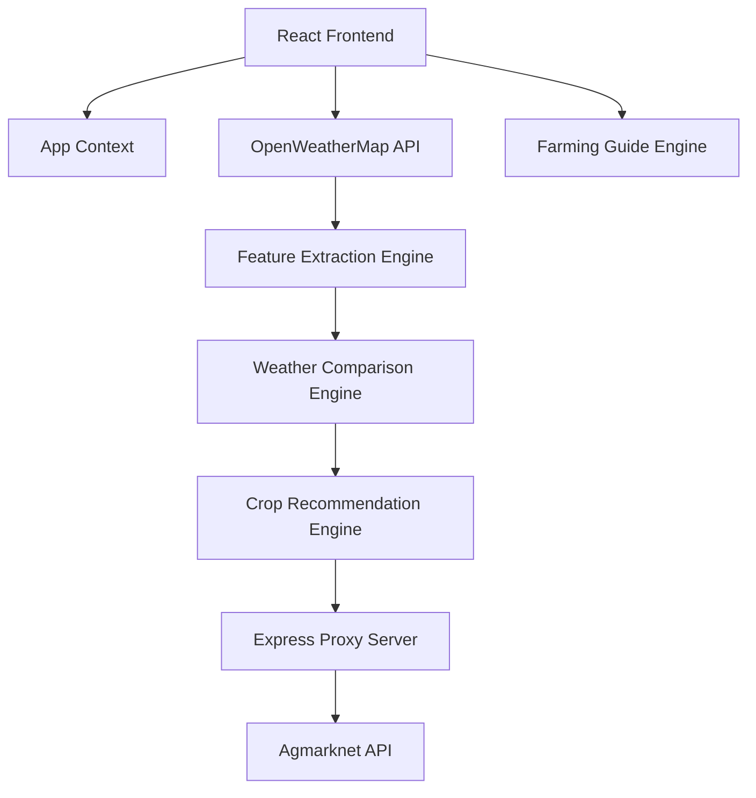

# Kisan-Mitr 🌾  
### Smart Agricultural Intelligence Platform for Farmers

> Kisan-Mitr (Farmer’s Friend) is an AI-powered agricultural advisory platform designed to help farmers make smarter farming decisions using real-time weather forecasting, soil analysis, crop recommendations, historical climate intelligence, and live mandi prices.

---
Website link: https://kisan-mitr-3-kgss.onrender.com/

# 📌 Overview

Kisan-Mitr is a modern agricultural intelligence platform built especially for farmers in Andhra Pradesh. The platform combines:

- 🌦️ Real-time weather forecasts
- 🛰️ NASA historical climate data
- 🌱 Soil-based crop recommendations
- 📈 Live mandi prices
- 📖 Dynamic farming guidance
- 🌐 Telugu + English bilingual support

The application is optimized for mobile devices and rural network conditions.

---

# 🚀 Features

## 🌦️ Smart Weather Intelligence
- Live weather forecasting using OpenWeatherMap API
- Temperature, rainfall, and humidity analysis
- Weather trend detection
- NASA climate comparison engine
- Seasonal anomaly prediction

---

## 🌱 AI-Based Crop Recommendation

The crop recommendation engine evaluates:

- District compatibility
- Soil suitability
- Weather alignment

### Scoring System

| Criteria | Weight |
|---|---|
| Weather Match | +50 |
| Soil Match | +30 |
| District Native Crop | +20 |

### Crop Categories
- ✅ Elite Matches
- 👍 Highly Suitable
- ⚠️ Use Caution

---

## 📖 Dynamic Farming Guide

Provides stage-wise farming guidance:

1. Soil Preparation
2. Sowing
3. Irrigation
4. Fertilizers
5. Pest Control
6. Harvesting

### Smart Climate Adjustments
- Low rainfall → irrigation alerts
- Heavy rainfall → drainage suggestions
- High temperature → mulching recommendations

---

## 📈 Live Mandi Prices
Integrated with Government of India Agmarknet API.

Features:
- Real-time commodity prices
- Crop name mapping
- Intelligent fallback search
- API response caching

---

## 🌐 Bilingual Support
- English
- Telugu (తెలుగు)

Designed for accessibility and ease of use for local farmers.

---

# 🏗️ System Architecture



---

# 🛠️ Tech Stack

## Frontend
- React 18
- TypeScript
- Vite
- Tailwind CSS
- Shadcn UI
- Radix UI
- TanStack Query
- Lucide React

## Backend
- Node.js
- Express.js

## APIs & Data Sources
- OpenWeatherMap API
- Data.gov.in Agmarknet API
- NASA POWER Historical Dataset

---

# 🧠 Core Engines

## 1. Weather Comparison Engine
Analyzes:
- Temperature
- Rainfall
- Humidity
- Rain trends

Uses:
- Live weather forecasts
- NASA historical averages

---

## 2. Crop Recommendation Engine
Predicts suitable crops using:
- Soil profile
- Weather classification
- District crop mapping

---

## 3. Farming Guide Engine
Generates adaptive farming practices based on:
- Rainfall
- Soil moisture
- Heat conditions

---

# 📂 Project Structure

```bash
Kisan-Mitr/
│
├── client/                 # React Frontend
├── server/                 # Express Backend
├── public/                 # Static Assets
├── src/
│   ├── components/
│   ├── pages/
│   ├── context/
│   ├── services/
│   ├── engines/
│   ├── data/
│   └── utils/
│
├── apMonthlyAverages.json
├── package.json
└── README.md
```

---

# ⚡ Performance Optimizations

- Lazy loading
- Asset prefetching
- API caching
- Mobile-first UI
- Low-bandwidth optimization
- Non-blocking React transitions

---

# 🔐 Security & Reliability

- API proxy protection
- CORS handling
- Government API credential security
- Retry mechanisms for unstable networks
- Memory caching for reduced API usage

---

# 📸 UI/UX Highlights

- High contrast daylight-friendly palette
- Mobile optimized layout
- Farmer-friendly navigation
- Visual crop guidance cards
- Accessible UI components

---

# 🌍 Real-World Impact

Kisan-Mitr helps:
- Reduce crop failure risks
- Improve farming productivity
- Detect climate anomalies
- Enable data-driven agriculture
- Support rural digital empowerment

---

# 🔧 Installation

## 1. Clone Repository

```bash
git clone https://github.com/your-username/kisan-mitr.git
cd kisan-mitr
```

---

## 2. Install Dependencies

```bash
npm install
```

---

## 3. Setup Environment Variables

Create a `.env` file:

```env
VITE_OPENWEATHER_API_KEY=your_api_key
DATA_GOV_API_KEY=your_api_key
```

---

## 4. Run Frontend

```bash
npm run dev
```

---

## 5. Start Backend

```bash
npm run server
```

---

# 📡 APIs Used

| API | Purpose |
|---|---|
| OpenWeatherMap | Weather Forecast |
| Data.gov.in | Mandi Prices |
| NASA POWER Dataset | Historical Climate Data |

---

# 🎯 Future Enhancements

- AI chatbot for farmers
- Voice-based Telugu assistant
- Pest disease detection using Machine Learning
- Satellite crop monitoring
- Offline support (PWA)
- Multi-state agricultural support

---

# 🤝 Contribution

Contributions are welcome.

```bash
Fork → Clone → Create Branch → Commit → Push → Pull Request
```

---

# 📜 License

This project is licensed under the MIT License.

---

# 👨‍💻 Developed By

**Afzal**  
B.Tech Student | AI & Full Stack Enthusiast

Focused on building smart technology solutions for agriculture and rural communities.

---

# ⭐ Support

If you like this project:

- ⭐ Star the repository
- 🍴 Fork the project
- 🛠️ Contribute improvements

---

# 📬 Contact

- Email: afzal97016458@gmail.com
